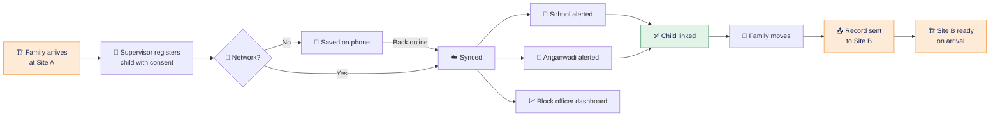

# 🧡 Sobat · सोबत

### *Every migrant child stays connected to school, anganwadi and care — wherever the family moves next.*

**[🚀 Live demo]()** · **[✨ Features](#-features)** · **[🗺️ How it works](#%EF%B8%8F-how-it-works)** · **[👥 Team](#-team)**

---

## 🎯 The problem

Migrant families move from worksite to worksite. **Every move breaks the child's link** to school, anganwadi and protection services. Records stay tied to the old place, nobody follows the child, and many simply drop out.

Nashik is building for the **Simhastha Kumbh 2027** right now: ghats, roads, rail and airport works, mostly done by migrant construction workers who bring their families. Their children are the ones who quietly lose out.

<table>
<tr>
<td align="center" width="33%">

### 📊 ~2 lakh
children under 14 migrate with their parents for sugarcane harvesting in Maharashtra every year
 IIPS field study, Jalna, 2021

</td>
<td align="center" width="33%">

### 👧 11.3%
of Maharashtra's ~8.9 lakh seasonal migrants are children
 Jalna child-protection study

</td>
<td align="center" width="33%">

### 🏗️ ₹544 Cr
of ghat and riverfront works alone sanctioned for the Kumbh
 Rajya Sabha reply, Jan 2026

</td>
</tr>
</table>

---

## 💡 The solution

**Sobat** is an offline-first register run by the people already on site. A supervisor registers each child when the family arrives. Sobat links the child to the nearest school and anganwadi, alerts block officers, and **carries the record to the next site when the family moves** — so services pick up where they left off instead of starting from zero.

> [!IMPORTANT]
> **The record belongs to the child, not to the place.** That one idea is what makes Sobat different from school-based or district-based systems that stop at a boundary.

---

## 👥 Who uses it

Sobat is **not a public app**. Only assigned people sign in.

| Role | What they do | Uses the app? |
| :--- | :--- | :---: |
| 🦺 **Site supervisor** / on-site volunteer | Registers children on arrival, records consent, marks families as moving | ✅ |
| 📈 **Block officer** | Sees every site, follows up children not yet linked | ✅ |
| 🏫 **Headteacher** / 🤱 **Anganwadi worker** | Receives the alert and confirms admission or enrolment | 🔜 |
| 👨‍👩‍👧 **Parent** | Gives consent and keeps the family card with a QR code | ❌ Never needs a smartphone |

---

## ✨ Features

<table>
<tr>
<td width="50%" valign="top">

### 🦺 Site supervisor
- 🏠 **Site home** with children, links and sync status
- 📝 **5-step registration**: child → family → school & health → consent → link services
- ✍️ **Consent with a finger-drawn signature** or thumb mark, read aloud to the parent
- 📍 **Nearest school and anganwadi** suggested by distance
- 🪪 **Family card** with a QR code any site can scan
- 🔁 **Mark family as moving** sends the record ahead
- 📷 **Scan a family card** to pick up an existing record

</td>
<td width="50%" valign="top">

### 📈 Block officer
- 🧮 **District overview** with headline numbers
- 📊 **Weekly arrivals vs. linked** bar chart
- 🍩 **Status donut**: linked, waiting, overdue
- 🌍 **Where families come from** by home district
- 👶 **Children by age** (anganwadi vs. school age)
- 🏗️ **Worksites ranked** by share of children linked
- 🔔 **Alerts** for children not linked after 7 days

</td>
</tr>
</table>

### 🌐 Built for the field

| | Feature | Why it matters |
| :---: | :--- | :--- |
| 📴 | **Works offline** | Construction sites have weak or no network. Records save on the phone and sync later. |
| 🗣️ | **English · मराठी · हिंदी** | Supervisors and families work in their own language. |
| 🗺️ | **Schematic map of Nashik** | Worksites, schools, anganwadis and the Godavari at a glance, with each child's journey traced. |
| 💉 | **Health continuity** | Weight at each site and immunisation status follow the child. |
| 🔒 | **Minimum data, with consent** | Only what's needed to keep the child in school; parents can ask for deletion. |

---

## 🗺️ How it works

## 📍 Pilot plan

| ⏱️ When | 🎯 Milestone |
| :--- | :--- |
| **0–3 months** | Working prototype, permissions, pilot on **5 Kumbh worksites** in Nashik |
| **3–6 months** | Pilot results; extend to **all Kumbh works** before the first Amrit Snan on **2 Aug 2027** |
| **6–12 months** | **Brick kilns** in Nashik district and **one sugarcane-season route** |
| **Then** | Statewide with Women & Child Development and School Education |

**💰 Estimated pilot cost:** about **₹1.5 lakh** for 5 sites, 3 months and 200 children (~₹750 per child), falling below ₹100 per child at scale.

---

## 🔒 Privacy and safety

- ✅ Parent consent is read aloud and signed before anything is saved
- ✅ Only assigned supervisors, schools, anganwadis and block officers can see a record
- ✅ Data is limited to what keeps the child in school and in care
- ✅ Parents can ask for a record to be deleted
- ❌ No face recognition, no tracking, no public access

> [!WARNING]
> **This repository contains sample data only.** Every child, parent, supervisor and record shown in the prototype is fictional. The map is a schematic, not GPS-accurate.

---

## 👥 Team

### Team N.E.R.V
**K. K. Wagh Institute of Engineering Education and Research, Nashik**

| 👤 Member | 🛠️ Role |
| :---: | :---: |
| **Hrishikesh Amol Gavai** | Lead Developer |

Built for the **Seva First Innovation Challenge 2026**, Maharashtra Zone, 
Sector: **Women and Child** · Sub-theme 5: **Migrant and seasonal-worker children**

---

